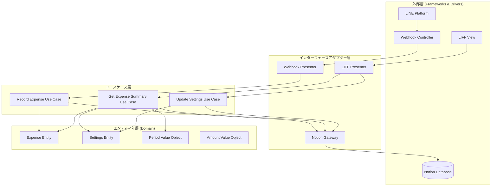

# 設計書

## 概要

支出管理アプリケーションは、LINE Messaging APIとLIFF（LINE Front-end Framework）を統合し、Notionをバックエンドデータベースとして使用するシステムです。ユーザーはLINEメッセージで支出を記録し、LIFFアプリで設定管理と合計額の表示を行います。

システムは以下の3つの主要な機能を提供します：

1. **メッセージングによる支出入力**: ユーザーがLINEで数値を送信すると、システムが解析してNotionに記録
2. **設定管理**: LIFFアプリで始まり日（1日または25日）を設定
3. **支出表示**: 設定に基づいた現在の期間の合計支出額を表示

## アーキテクチャ

システムはクリーンアーキテクチャの原則に従って設計されます。依存関係は外側から内側に向かい、ビジネスロジックは外部フレームワークやデータベースから独立しています。



### クリーンアーキテクチャの層

#### 1. エンティティ層（Domain Layer）

ビジネスルールとドメインロジックを含む最も内側の層。外部の変更から完全に独立しています。

**エンティティ:**
- `Expense`: 支出を表現するエンティティ
- `Settings`: アプリケーション設定を表現するエンティティ

**値オブジェクト:**
- `Amount`: 金額を表現する値オブジェクト（検証ロジックを含む）
- `Period`: 期間を表現する値オブジェクト（期間計算ロジックを含む）
- `ExpenseDate`: 日付を表現する値オブジェクト

#### 2. ユースケース層（Application Business Rules）

アプリケーション固有のビジネスルールを含みます。エンティティを使用してユースケースを実装します。

**ユースケース:**
- `RecordExpenseUseCase`: 支出を記録する
- `GetExpenseSummaryUseCase`: 期間の支出合計を取得する
- `UpdateSettingsUseCase`: 設定を更新する

**リポジトリインターフェース（ポート）:**
- `ExpenseRepository`: 支出データの永続化インターフェース
- `SettingsRepository`: 設定データの永続化インターフェース

#### 3. インターフェースアダプター層（Interface Adapters）

外部とユースケースの間でデータを変換します。

**プレゼンター:**
- `WebhookPresenter`: Webhookリクエストをユースケースに変換
- `LIFFPresenter`: LIFFリクエストをユースケースに変換

**ゲートウェイ（アダプター）:**
- `NotionExpenseGateway`: ExpenseRepositoryの実装
- `NotionSettingsGateway`: SettingsRepositoryの実装

#### 4. 外部層（Frameworks & Drivers）

フレームワーク、データベース、UIなどの外部ツール。

**コントローラー:**
- `WebhookController`: LINE Webhook APIのエンドポイント
- `LIFFController`: LIFFアプリのエンドポイント

**外部サービス:**
- LINE Messaging API
- Notion API
- Notion Database

### 依存関係の規則

1. **依存関係の方向**: 外側の層は内側の層に依存できるが、内側の層は外側の層を知らない
2. **依存性逆転の原則**: ユースケース層はリポジトリインターフェース（ポート）を定義し、外側の層がそれを実装（アダプター）
3. **エンティティの独立性**: エンティティ層は他のすべての層から独立

## コンポーネントとインターフェース

### エンティティ層（Domain Layer）

#### 1. Expense Entity

支出を表現するエンティティです。

**責務:**
- 支出の不変条件を保証
- 支出の同一性を管理

**インターフェース:**
```typescript
class Expense {
  private constructor(
    private readonly id: string,
    private readonly amount: Amount,
    private readonly date: ExpenseDate
  ) {}
  
  static create(amount: Amount, date: ExpenseDate): Expense
  static reconstitute(id: string, amount: Amount, date: ExpenseDate): Expense
  
  getId(): string
  getAmount(): Amount
  getDate(): ExpenseDate
  isInPeriod(period: Period): boolean
}
```

#### 2. Settings Entity

アプリケーション設定を表現するエンティティです。

**責務:**
- 設定の不変条件を保証
- 設定値の検証

**インターフェース:**
```typescript
class Settings {
  private constructor(
    private readonly id: string,
    private startDay: StartDay
  ) {}
  
  static create(startDay: StartDay): Settings
  static reconstitute(id: string, startDay: StartDay): Settings
  
  getId(): string
  getStartDay(): StartDay
  updateStartDay(newStartDay: StartDay): void
}

type StartDay = 1 | 25
```

#### 3. Amount Value Object

金額を表現する値オブジェクトです。

**責務:**
- 金額の検証
- 金額の不変性を保証

**インターフェース:**
```typescript
class Amount {
  private constructor(private readonly value: number) {}
  
  static fromString(input: string): Result<Amount, ParseError>
  static fromNumber(value: number): Result<Amount, ValidationError>
  
  getValue(): number
  add(other: Amount): Amount
  equals(other: Amount): boolean
}
```

**検証ルール:**
- 0以上の数値
- カンマ区切りの処理
- 単一の数値のみ

#### 4. Period Value Object

期間を表現する値オブジェクトです。

**責務:**
- 期間の計算ロジック
- 日付が期間内かどうかの判定

**インターフェース:**
```typescript
class Period {
  private constructor(
    private readonly startDate: Date,
    private readonly endDate: Date
  ) {}
  
  static calculateForStartDay(startDay: StartDay, currentDate: Date): Period
  
  getStartDate(): Date
  getEndDate(): Date
  contains(date: Date): boolean
}
```

**期間計算ロジック:**
- 始まり日が1の場合: 当月1日〜当月末日
- 始まり日が25の場合:
  - 現在が1-24日: 前月25日〜当月24日
  - 現在が25日以降: 当月25日〜翌月24日

#### 5. ExpenseDate Value Object

日付を表現する値オブジェクトです。

**責務:**
- 日付の不変性を保証
- 日付の比較

**インターフェース:**
```typescript
class ExpenseDate {
  private constructor(private readonly value: Date) {}
  
  static fromDate(date: Date): ExpenseDate
  static now(): ExpenseDate
  
  getValue(): Date
  isBefore(other: ExpenseDate): boolean
  isAfter(other: ExpenseDate): boolean
  equals(other: ExpenseDate): boolean
}
```

### ユースケース層（Application Business Rules）

#### 1. RecordExpenseUseCase

支出を記録するユースケースです。

**責務:**
- 入力から金額を抽出
- 支出エンティティを作成
- リポジトリに保存

**インターフェース:**
```typescript
interface RecordExpenseUseCase {
  execute(input: RecordExpenseInput): Promise<RecordExpenseOutput>
}

interface RecordExpenseInput {
  amountText: string
}

type RecordExpenseOutput = 
  | { success: true; message: string }
  | { success: false; error: string }
```

**依存関係:**
- `ExpenseRepository`: 支出の永続化

**処理フロー:**
1. 入力テキストからAmountを作成（検証を含む）
2. 現在の日付でExpenseDateを作成
3. Expenseエンティティを作成
4. ExpenseRepositoryで保存
5. 成功/失敗の結果を返す

#### 2. GetExpenseSummaryUseCase

期間の支出合計を取得するユースケースです。

**責務:**
- 設定から始まり日を取得
- 現在の期間を計算
- 期間内の支出を取得
- 合計を計算

**インターフェース:**
```typescript
interface GetExpenseSummaryUseCase {
  execute(input: GetExpenseSummaryInput): Promise<GetExpenseSummaryOutput>
}

interface GetExpenseSummaryInput {
  currentDate?: Date // テスト用、省略時は現在日時
}

interface GetExpenseSummaryOutput {
  totalAmount: number
  period: {
    startDate: Date
    endDate: Date
  }
}
```

**依存関係:**
- `ExpenseRepository`: 支出の取得
- `SettingsRepository`: 設定の取得

**処理フロー:**
1. SettingsRepositoryから設定を取得
2. 始まり日と現在日付からPeriodを計算
3. ExpenseRepositoryから期間内の支出を取得
4. 合計金額を計算
5. 結果を返す

#### 3. UpdateSettingsUseCase

設定を更新するユースケースです。

**責務:**
- 設定を取得
- 始まり日を更新
- 設定を保存

**インターフェース:**
```typescript
interface UpdateSettingsUseCase {
  execute(input: UpdateSettingsInput): Promise<UpdateSettingsOutput>
}

interface UpdateSettingsInput {
  startDay: StartDay
}

type UpdateSettingsOutput = 
  | { success: true }
  | { success: false; error: string }
```

**依存関係:**
- `SettingsRepository`: 設定の取得と保存

**処理フロー:**
1. SettingsRepositoryから現在の設定を取得
2. 設定の始まり日を更新
3. SettingsRepositoryで保存
4. 成功/失敗の結果を返す

#### リポジトリインターフェース（ポート）

```typescript
interface ExpenseRepository {
  save(expense: Expense): Promise<void>
  findByPeriod(period: Period): Promise<Expense[]>
}

interface SettingsRepository {
  get(): Promise<Settings>
  save(settings: Settings): Promise<void>
}
```

### インターフェースアダプター層

#### 1. WebhookPresenter

Webhookリクエストをユースケースに変換します。

**責務:**
- LINE Webhookイベントの解析
- RecordExpenseUseCaseの呼び出し
- 結果をLINEメッセージ形式に変換

**インターフェース:**
```typescript
interface WebhookPresenter {
  handleMessage(event: LineMessageEvent): Promise<LineReplyMessage>
}
```

#### 2. LIFFPresenter

LIFFリクエストをユースケースに変換します。

**責務:**
- LIFFリクエストの解析
- ユースケースの呼び出し
- 結果をLIFF表示形式に変換

**インターフェース:**
```typescript
interface LIFFPresenter {
  getSummary(): Promise<SummaryViewModel>
  updateStartDay(startDay: StartDay): Promise<UpdateResult>
}

interface SummaryViewModel {
  totalAmount: string // フォーマット済み（例: "¥1,000"）
  periodText: string // 期間テキスト（例: "2024/1/1 - 2024/1/31"）
}
```

#### 3. NotionExpenseGateway

ExpenseRepositoryの実装です。

**責務:**
- ExpenseエンティティをNotionデータ形式に変換
- NotionデータをExpenseエンティティに変換
- Notion APIの呼び出し

**インターフェース:**
```typescript
class NotionExpenseGateway implements ExpenseRepository {
  constructor(private notionClient: NotionClient) {}
  
  async save(expense: Expense): Promise<void>
  async findByPeriod(period: Period): Promise<Expense[]>
}
```

#### 4. NotionSettingsGateway

SettingsRepositoryの実装です。

**責務:**
- SettingsエンティティをNotionデータ形式に変換
- NotionデータをSettingsエンティティに変換
- Notion APIの呼び出し

**インターフェース:**
```typescript
class NotionSettingsGateway implements SettingsRepository {
  constructor(private notionClient: NotionClient) {}
  
  async get(): Promise<Settings>
  async save(settings: Settings): Promise<void>
}
```

### 外部層（Frameworks & Drivers）

#### 1. WebhookController

LINE Webhook APIのエンドポイントです。

**責務:**
- HTTPリクエストの受信
- 署名検証
- WebhookPresenterへの委譲
- HTTPレスポンスの返却

**インターフェース:**
```typescript
class WebhookController {
  constructor(private presenter: WebhookPresenter) {}
  
  async handleRequest(req: Request): Promise<Response>
}
```

#### 2. LIFFController

LIFFアプリのエンドポイントです。

**責務:**
- HTTPリクエストの受信
- LIFFPresenterへの委譲
- HTTPレスポンスの返却

**インターフェース:**
```typescript
class LIFFController {
  constructor(private presenter: LIFFPresenter) {}
  
  async getSummary(req: Request): Promise<Response>
  async updateSettings(req: Request): Promise<Response>
}
```

#### 3. LIFFView

LIFFアプリのUIコンポーネントです。

**責務:**
- UIの表示
- ユーザー操作の処理
- LIFFControllerへのリクエスト送信

**コンポーネント:**
- 合計額表示
- 始まり日トグルスイッチ
- ローディング表示
- エラー表示

## データモデル

### Notion 支出データベース

**プロパティ:**
- `金額` (Number): 支出金額
- `日付` (Date): 支出日
- `作成日時` (Created time): レコード作成日時（自動）

**インデックス:**
- 日付フィールドでソート可能

### Notion 設定データベース

**プロパティ:**
- `設定名` (Title): 設定項目の名前（例: "始まり日"）
- `値` (Number): 設定値（1または25）
- `更新日時` (Last edited time): 最終更新日時（自動）

**制約:**
- 始まり日設定は単一のレコードとして管理
- 値は1または25のみ許可


## 正確性プロパティ

プロパティとは、システムのすべての有効な実行において真であるべき特性や動作のことです。プロパティは、人間が読める仕様と機械で検証可能な正確性保証の橋渡しとなります。

以下のプロパティは、要件定義書の受入基準から導出され、プロパティベーステストとして実装されます。

### プロパティ1: 有効な数値入力の記録

*任意の*有効な数値入力（カンマの有無を問わない）に対して、システムは数値を正しく抽出し、現在の日付とともにNotionデータベースに記録し、記録されたデータには日付フィールドと金額フィールドが含まれていなければならない

**検証: 要件 1.1, 6.1**

### プロパティ2: 成功メッセージの返信

*任意の*有効な数値入力に対して、システムが支出の記録に成功したとき、ユーザーに成功メッセージを返信しなければならない

**検証: 要件 1.2**

### プロパティ3: 無効な入力のエラー処理

*任意の*無効な入力（複数の数値、非数値文字を含む文字列など）に対して、システムはエラーメッセージを返信し、データベースにデータを記録してはならない

**検証: 要件 1.3**

### プロパティ4: 設定更新のラウンドトリップ

*任意の*始まり日設定値（1または25）に対して、設定を更新した後に取得した値は、更新した値と同じでなければならない

**検証: 要件 2.1, 6.2**

### プロパティ5: 始まり日が1のときの期間計算

*任意の*日付に対して、始まり日設定が1のとき、システムは当月1日から当月末日までの期間を計算しなければならない

**検証: 要件 3.1**

### プロパティ6: 始まり日が25で1-24日のときの期間計算

*任意の*1日から24日の間の日付に対して、始まり日設定が25のとき、システムは前月25日から当月24日までの期間を計算しなければならない

**検証: 要件 3.2**

### プロパティ7: 始まり日が25で25日以降のときの期間計算

*任意の*25日以降の日付に対して、始まり日設定が25のとき、システムは当月25日から翌月24日までの期間を計算しなければならない

**検証: 要件 3.3**

### プロパティ8: 合計額の正しい計算

*任意の*支出データセットと始まり日設定に対して、システムは設定に基づいた現在の期間内の支出のみを集計し、正しい合計額を計算しなければならない

**検証: 要件 4.2**

### プロパティ9: 個別記録の非表示

*任意の*表示状態において、LIFFアプリの表示には個別の支出記録が含まれず、合計額のみが表示されなければならない

**検証: 要件 4.3**

### プロパティ10: カンマ区切りの同等性

*任意の*数値に対して、カンマ区切りありの表現（例: "1,000"）とカンマ区切りなしの表現（例: "1000"）は、システムによって同じ数値として解析されなければならない

**検証: 要件 5.1, 5.2, 5.3**

### プロパティ11: APIエラーの適切な処理

*任意の*Notion APIエラーに対して、システムはエラーを適切に処理し、ユーザーに失敗を報告しなければならない

**検証: 要件 6.3**

## エラーハンドリング

### 入力検証エラー

**エラーケース:**
- 複数の数値が含まれる入力（例: "1000 2000"）
- 非数値文字が含まれる入力（例: "abc", "1000円"）
- 空文字列

**処理:**
- エラーメッセージをLINEで返信
- データベースへの書き込みを行わない
- エラーログを記録

**エラーメッセージ例:**
```
申し訳ございません。数値のみを入力してください。
例: 1000 または 1,000
```

### Notion APIエラー

**エラーケース:**
- 認証エラー（401 Unauthorized）
- レート制限エラー（429 Too Many Requests）
- データベースが見つからない（404 Not Found）
- ネットワークエラー

**処理:**
- ユーザーにエラーメッセージを返信
- エラーの詳細をログに記録
- 必要に応じてリトライ（レート制限の場合）

**エラーメッセージ例:**
```
一時的なエラーが発生しました。
しばらくしてから再度お試しください。
```

### LIFFアプリのエラー

**エラーケース:**
- LIFF初期化失敗
- データ取得失敗
- 設定更新失敗

**処理:**
- UIにエラーメッセージを表示
- ローディング状態を解除
- エラーログを記録
- リトライボタンを表示

**エラーメッセージ例:**
```
データの読み込みに失敗しました。
[再試行]
```

### リトライ戦略

**Notion API呼び出し:**
- 最大3回のリトライ
- 指数バックオフ（1秒、2秒、4秒）
- レート制限エラーの場合は Retry-After ヘッダーに従う

## テスト戦略

### デュアルテストアプローチ

システムの正確性を保証するため、ユニットテストとプロパティベーステストの両方を使用します：

- **ユニットテスト**: 特定の例、エッジケース、エラー条件を検証
- **プロパティベーステスト**: すべての入力に対する普遍的なプロパティを検証

両方のアプローチは補完的であり、包括的なカバレッジに必要です。

### プロパティベーステスト

**使用ライブラリ:**
- TypeScript/JavaScript: `fast-check`

**設定:**
- 各プロパティテストは最低100回の反復を実行
- 各テストは設計書のプロパティを参照するタグを含む
- タグ形式: `Feature: expense-management-app, Property N: [プロパティテキスト]`

**テスト対象:**
- プロパティ1-11（上記の正確性プロパティセクションで定義）
- 各プロパティは単一のプロパティベーステストとして実装

### ユニットテスト

**テスト対象:**

1. **Input Parser**
   - 有効な数値の解析（例: "1000", "1,000", "999999"）
   - 無効な入力の拒否（例: "abc", "1000 2000", ""）
   - エッジケース: "0", "1", 非常に大きな数値

2. **Period Calculator**
   - 始まり日1の期間計算（例: 2024年1月15日 → 2024/1/1-1/31）
   - 始まり日25の期間計算（前半: 2024年1月15日 → 2023/12/25-2024/1/24）
   - 始まり日25の期間計算（後半: 2024年1月26日 → 2024/1/25-2/24）
   - 月末の境界ケース（28日、29日、30日、31日）

3. **Notion API Client**
   - 成功時のレスポンス処理
   - エラーレスポンスの処理
   - リトライロジック

4. **Webhook Handler**
   - メッセージイベントのフィルタリング
   - 応答メッセージの送信

5. **LIFF Application**
   - 設定トグルの動作
   - 表示の更新
   - エラー状態の処理

### 統合テスト

**テストシナリオ:**

1. **エンドツーエンド: 支出記録**
   - LINEメッセージ送信 → Webhook処理 → Notion記録 → 成功応答

2. **エンドツーエンド: 設定変更と表示**
   - LIFF起動 → 設定取得 → 設定変更 → 表示更新

3. **エンドツーエンド: 期間をまたぐ計算**
   - 複数の支出を記録 → 期間計算 → 正しい合計表示

**モック戦略:**
- Notion APIはモックを使用（統合テストでは実際のAPIを使用しない）
- LINE APIはモックを使用
- 日付は固定値を使用（テストの再現性のため）

### テストカバレッジ目標

- コードカバレッジ: 80%以上
- ブランチカバレッジ: 75%以上
- すべての正確性プロパティがテストされていること
- すべてのエラーケースがテストされていること
