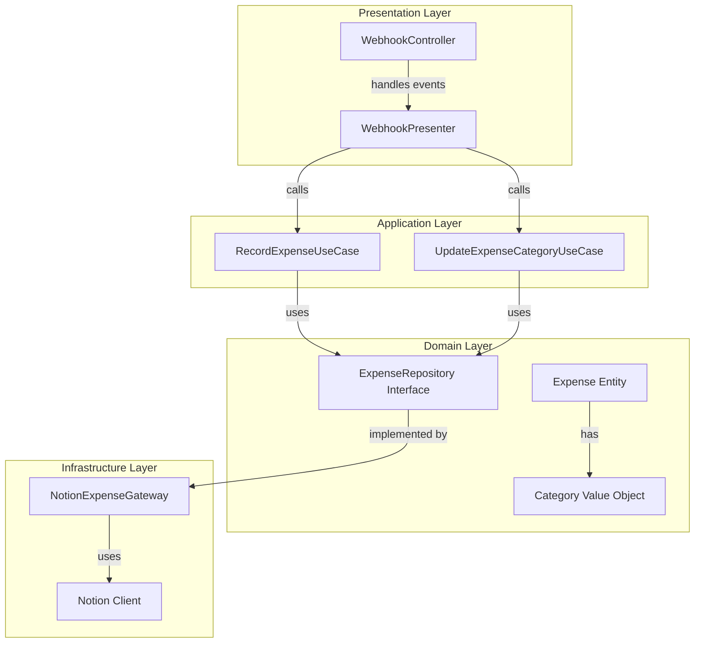
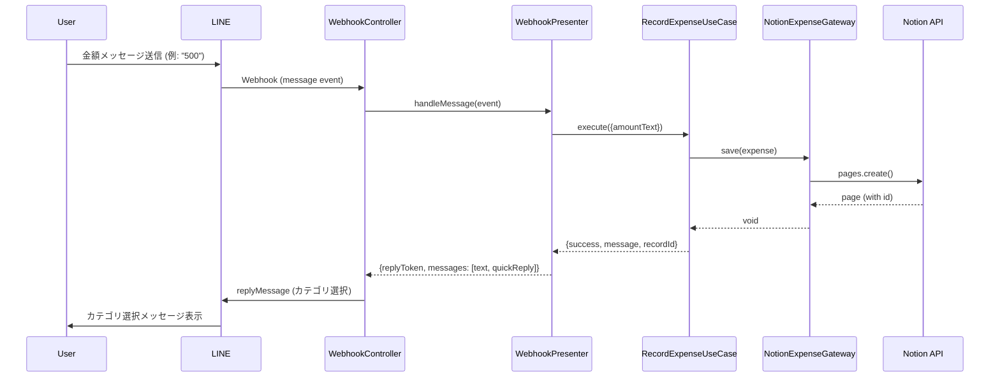
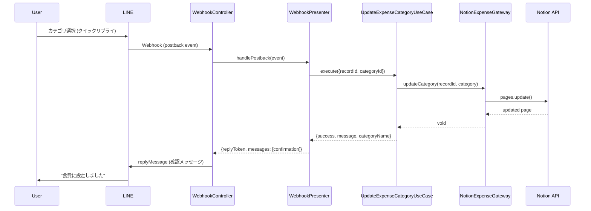

# Design Document: LINE Category Selection

## Overview

本設計は、expenses-appにおけるLINEカテゴリ選択機能の技術実装を定義します。この機能により、ユーザーがLINEで金額を送信した後、カテゴリを選択してNotionレコードを完成させることができます。

### 設計の目的

- 金額送信時にNotionレコードを即座に作成し、データの確実な保存を保証する
- LINEのインタラクティブメッセージ（クイックリプライ）を使用して、直感的なカテゴリ選択UIを提供する
- 既存のクリーンアーキテクチャを維持しながら、新機能を統合する
- Postbackイベントを使用して、レコードIDとカテゴリ選択を正確に関連付ける

### 主要な技術的決定

1. **カテゴリの値オブジェクト化**: カテゴリをドメイン層の値オブジェクトとして実装し、型安全性を確保
2. **Expenseエンティティの拡張**: 既存のExpenseエンティティにカテゴリフィールドを追加（オプショナル）
3. **新しいユースケースの追加**: `UpdateExpenseCategoryUseCase`を作成し、カテゴリ更新ロジックを分離
4. **WebhookControllerの拡張**: Postbackイベントのハンドリングを追加
5. **クイックリプライの使用**: LINEのクイックリプライ機能を使用して、ワンタップでのカテゴリ選択を実現

## Architecture

本機能は、既存のクリーンアーキテクチャに従い、以下の層で実装されます：



### データフロー

#### フロー1: 金額送信とカテゴリ選択メッセージの送信



#### フロー2: カテゴリ選択とレコード更新



## Components and Interfaces

### 1. Domain Layer

#### 1.1 Category Value Object (新規)

```typescript
// src/domain/value-objects/Category.ts

export type CategoryId = 
  | 'food'
  | 'transportation'
  | 'entertainment'
  | 'daily-goods'
  | 'other';

export interface CategoryData {
  id: CategoryId;
  displayName: string;
}

export class Category {
  private static readonly CATEGORIES: Record<CategoryId, string> = {
    'food': '食費',
    'transportation': '交通費',
    'entertainment': '娯楽',
    'daily-goods': '日用品',
    'other': 'その他'
  };

  private constructor(private readonly id: CategoryId) {}

  static fromId(id: string): Result<Category, ValidationError> {
    if (!this.isValidCategoryId(id)) {
      return {
        success: false,
        error: new ValidationError(`Invalid category id: ${id}`)
      };
    }
    return {
      success: true,
      value: new Category(id as CategoryId)
    };
  }

  static getAllCategories(): CategoryData[] {
    return Object.entries(this.CATEGORIES).map(([id, displayName]) => ({
      id: id as CategoryId,
      displayName
    }));
  }

  private static isValidCategoryId(id: string): id is CategoryId {
    return id in this.CATEGORIES;
  }

  getId(): CategoryId {
    return this.id;
  }

  getDisplayName(): string {
    return Category.CATEGORIES[this.id];
  }

  equals(other: Category): boolean {
    return this.id === other.id;
  }
}
```

#### 1.2 Expense Entity (拡張)

```typescript
// src/domain/entities/Expense.ts (変更箇所のみ)

import { Category } from '../value-objects/Category';

export class Expense {
  private constructor(
    private readonly id: string,
    private readonly amount: Amount,
    private readonly date: ExpenseDate,
    private readonly category?: Category  // 追加: オプショナル
  ) {}

  static create(amount: Amount, date: ExpenseDate): Expense {
    const id = randomUUID();
    return new Expense(id, amount, date, undefined);
  }

  static reconstitute(
    id: string, 
    amount: Amount, 
    date: ExpenseDate,
    category?: Category  // 追加
  ): Expense {
    return new Expense(id, amount, date, category);
  }

  // 新規メソッド: カテゴリを設定した新しいExpenseを返す
  withCategory(category: Category): Expense {
    return new Expense(this.id, this.amount, this.date, category);
  }

  getCategory(): Category | undefined {
    return this.category;
  }

  hasCategory(): boolean {
    return this.category !== undefined;
  }
}
```

#### 1.3 ExpenseRepository Interface (拡張)

```typescript
// src/application/repositories/ExpenseRepository.ts (追加メソッド)

export interface ExpenseRepository {
  save(expense: Expense): Promise<void>;
  findByPeriod(period: Period): Promise<Expense[]>;
  
  // 新規メソッド
  findById(id: string): Promise<Expense | null>;
  updateCategory(id: string, category: Category): Promise<void>;
}
```

### 2. Application Layer

#### 2.1 RecordExpenseUseCase (拡張)

```typescript
// src/application/use-cases/RecordExpenseUseCase.ts (変更箇所)

export interface RecordExpenseResult {
  success: boolean;
  message: string;
  recordId?: string;  // 追加: Notionレコードのページ ID
}

export class RecordExpenseUseCaseImpl implements RecordExpenseUseCase {
  async execute(input: RecordExpenseInput): Promise<RecordExpenseResult> {
    // 金額のパース
    const amountResult = Amount.fromText(input.amountText);
    if (!amountResult.success) {
      return {
        success: false,
        message: '金額の形式が正しくありません。数字で入力してください。'
      };
    }

    // Expenseエンティティの作成（カテゴリなし）
    const expense = Expense.create(
      amountResult.value,
      ExpenseDate.fromDate(new Date())
    );

    // リポジトリに保存
    await this.expenseRepository.save(expense);

    return {
      success: true,
      message: `${amountResult.value.getValue()}円を記録しました`,
      recordId: expense.getId()  // 追加: レコードIDを返す
    };
  }
}
```

#### 2.2 UpdateExpenseCategoryUseCase (新規)

```typescript
// src/application/use-cases/UpdateExpenseCategoryUseCase.ts

import { ExpenseRepository } from '../repositories/ExpenseRepository';
import { Category } from '../../domain/value-objects/Category';

export interface UpdateExpenseCategoryInput {
  recordId: string;
  categoryId: string;
}

export interface UpdateExpenseCategoryResult {
  success: boolean;
  message: string;
  categoryName?: string;
}

export interface UpdateExpenseCategoryUseCase {
  execute(input: UpdateExpenseCategoryInput): Promise<UpdateExpenseCategoryResult>;
}

export class UpdateExpenseCategoryUseCaseImpl implements UpdateExpenseCategoryUseCase {
  constructor(private readonly expenseRepository: ExpenseRepository) {}

  async execute(input: UpdateExpenseCategoryInput): Promise<UpdateExpenseCategoryResult> {
    // カテゴリの検証
    const categoryResult = Category.fromId(input.categoryId);
    if (!categoryResult.success) {
      return {
        success: false,
        message: '無効なカテゴリが選択されました'
      };
    }

    const category = categoryResult.value;

    // レコードの存在確認
    const expense = await this.expenseRepository.findById(input.recordId);
    if (!expense) {
      return {
        success: false,
        message: 'レコードが見つかりませんでした'
      };
    }

    // カテゴリの更新
    await this.expenseRepository.updateCategory(input.recordId, category);

    return {
      success: true,
      message: `${category.getDisplayName()}に設定しました`,
      categoryName: category.getDisplayName()
    };
  }
}
```

### 3. Presentation Layer

#### 3.1 WebhookController (拡張)

```typescript
// src/presentation/controllers/WebhookController.ts (変更箇所)

export interface LinePostbackEvent {
  type: 'postback';
  postback: {
    data: string;
  };
  replyToken: string;
}

export class WebhookController {
  async handleRequest(req: WebhookRequest): Promise<WebhookResponse> {
    // ... 署名検証 ...

    const webhookBody: LineWebhookBody = JSON.parse(req.body);
    const replies = [];

    for (const event of webhookBody.events) {
      // メッセージイベントの処理
      if (event.type === 'message' && 'message' in event && event.message.type === 'text') {
        const reply = await this.presenter.handleMessage(event as LineMessageEvent);
        replies.push(reply);
      }
      
      // Postbackイベントの処理（新規）
      if (event.type === 'postback' && 'postback' in event) {
        const reply = await this.presenter.handlePostback(event as LinePostbackEvent);
        replies.push(reply);
      }
    }

    return {
      statusCode: 200,
      body: JSON.stringify({ replies })
    };
  }
}
```

#### 3.2 WebhookPresenter (拡張)

```typescript
// src/presentation/presenters/WebhookPresenter.ts

import { RecordExpenseUseCase } from '../../application/use-cases/RecordExpenseUseCase';
import { UpdateExpenseCategoryUseCase } from '../../application/use-cases/UpdateExpenseCategoryUseCase';
import { Category } from '../../domain/value-objects/Category';

export interface LineQuickReplyItem {
  type: 'action';
  action: {
    type: 'postback';
    label: string;
    data: string;
    displayText: string;
  };
}

export interface LineReplyMessage {
  replyToken: string;
  messages: Array<{
    type: 'text';
    text: string;
    quickReply?: {
      items: LineQuickReplyItem[];
    };
  }>;
}

export interface WebhookPresenter {
  handleMessage(event: LineMessageEvent): Promise<LineReplyMessage>;
  handlePostback(event: LinePostbackEvent): Promise<LineReplyMessage>;
}

export class WebhookPresenterImpl implements WebhookPresenter {
  constructor(
    private readonly recordExpenseUseCase: RecordExpenseUseCase,
    private readonly updateExpenseCategoryUseCase: UpdateExpenseCategoryUseCase
  ) {}

  async handleMessage(event: LineMessageEvent): Promise<LineReplyMessage> {
    const messageText = event.message.text;
    const result = await this.recordExpenseUseCase.execute({
      amountText: messageText
    });

    if (!result.success) {
      return {
        replyToken: event.replyToken,
        messages: [{
          type: 'text',
          text: result.message
        }]
      };
    }

    // 成功時: カテゴリ選択メッセージを生成
    const quickReplyItems = this.createCategoryQuickReply(result.recordId!);

    return {
      replyToken: event.replyToken,
      messages: [{
        type: 'text',
        text: result.message + '\n\nカテゴリを選択してください',
        quickReply: {
          items: quickReplyItems
        }
      }]
    };
  }

  async handlePostback(event: LinePostbackEvent): Promise<LineReplyMessage> {
    // Postbackデータのパース: "category:{categoryId}:record:{recordId}"
    const { categoryId, recordId } = this.parsePostbackData(event.postback.data);

    if (!categoryId || !recordId) {
      return {
        replyToken: event.replyToken,
        messages: [{
          type: 'text',
          text: 'カテゴリの選択に失敗しました'
        }]
      };
    }

    // カテゴリ更新ユースケースを実行
    const result = await this.updateExpenseCategoryUseCase.execute({
      recordId,
      categoryId
    });

    return {
      replyToken: event.replyToken,
      messages: [{
        type: 'text',
        text: result.message
      }]
    };
  }

  private createCategoryQuickReply(recordId: string): LineQuickReplyItem[] {
    const categories = Category.getAllCategories();
    
    return categories.map(cat => ({
      type: 'action' as const,
      action: {
        type: 'postback' as const,
        label: cat.displayName,
        data: `category:${cat.id}:record:${recordId}`,
        displayText: cat.displayName
      }
    }));
  }

  private parsePostbackData(data: string): { categoryId?: string; recordId?: string } {
    // "category:{categoryId}:record:{recordId}" の形式をパース
    const match = data.match(/^category:([^:]+):record:(.+)$/);
    if (!match) {
      return {};
    }

    return {
      categoryId: match[1],
      recordId: match[2]
    };
  }
}
```

### 4. Infrastructure Layer

#### 4.1 NotionExpenseGateway (拡張)

```typescript
// src/infrastructure/gateways/NotionExpenseGateway.ts (追加メソッド)

export class NotionExpenseGateway implements ExpenseRepository {
  // ... 既存のメソッド ...

  /**
   * IDでExpenseを検索
   */
  async findById(id: string): Promise<Expense | null> {
    try {
      const page = await this.withRetry(async () => {
        return await this.client.pages.retrieve({ page_id: id });
      });

      return this.pageToExpense(page);
    } catch (error: any) {
      if (error.code === 'object_not_found') {
        return null;
      }
      throw error;
    }
  }

  /**
   * Expenseのカテゴリを更新
   */
  async updateCategory(id: string, category: Category): Promise<void> {
    await this.withRetry(async () => {
      await this.client.pages.update({
        page_id: id,
        properties: {
          'カテゴリ': {
            select: {
              name: category.getDisplayName()
            }
          }
        }
      });
    });
  }

  /**
   * NotionページをExpenseエンティティに変換（カテゴリ対応）
   */
  private pageToExpense(page: any): Expense | null {
    try {
      const id = page.id;
      
      // 金額プロパティの取得
      const amountProperty = page.properties['金額'];
      if (amountProperty?.type !== 'number' || typeof amountProperty.number !== 'number') {
        console.error('Invalid amount property:', amountProperty);
        return null;
      }
      
      const amountResult = Amount.fromNumber(amountProperty.number);
      if (!amountResult.success) {
        console.error('Failed to create Amount:', amountResult.error);
        return null;
      }
      
      // 日付プロパティの取得
      const dateProperty = page.properties['日付'];
      if (dateProperty?.type !== 'date' || !dateProperty.date?.start) {
        console.error('Invalid date property:', dateProperty);
        return null;
      }
      
      const date = new Date(dateProperty.date.start);
      const expenseDate = ExpenseDate.fromDate(date);
      
      // カテゴリプロパティの取得（オプショナル）
      let category: Category | undefined;
      const categoryProperty = page.properties['カテゴリ'];
      if (categoryProperty?.type === 'select' && categoryProperty.select?.name) {
        // 表示名からカテゴリIDを逆引き
        const categoryData = Category.getAllCategories().find(
          cat => cat.displayName === categoryProperty.select.name
        );
        if (categoryData) {
          const categoryResult = Category.fromId(categoryData.id);
          if (categoryResult.success) {
            category = categoryResult.value;
          }
        }
      }
      
      return Expense.reconstitute(id, amountResult.value, expenseDate, category);
    } catch (error) {
      console.error('Error converting page to Expense:', error);
      return null;
    }
  }
}
```

#### 4.2 Container (DI) (拡張)

```typescript
// src/infrastructure/di/Container.ts (追加メソッド)

export class Container {
  // ... 既存のメソッド ...

  getUpdateExpenseCategoryUseCase(): UpdateExpenseCategoryUseCase {
    return new UpdateExpenseCategoryUseCaseImpl(
      this.getExpenseRepository()
    );
  }

  getWebhookPresenter(): WebhookPresenter {
    return new WebhookPresenterImpl(
      this.getRecordExpenseUseCase(),
      this.getUpdateExpenseCategoryUseCase()  // 追加
    );
  }
}
```

## Data Models

### Notion Database Schema

既存のNotionデータベースに以下のプロパティを追加する必要があります：

| プロパティ名 | タイプ | 説明 | 必須 |
|------------|--------|------|------|
| 金額 | Number | 支出金額 | ✓ |
| 日付 | Date | 支出日時 | ✓ |
| カテゴリ | Select | 支出カテゴリ | - |

#### カテゴリのSelect Options

Notionデータベースの「カテゴリ」プロパティには、以下のオプションを設定します：

- 食費
- 交通費
- 娯楽
- 日用品
- その他

### LINE Postback Data Format

カテゴリ選択時のPostbackデータは以下の形式を使用します：

```
category:{categoryId}:record:{recordId}
```

例:
```
category:food:record:a1b2c3d4-e5f6-7890-abcd-ef1234567890
```

この形式により：
- カテゴリIDとレコードIDを1つの文字列で表現
- パースが容易で、エラーハンドリングが明確
- LINEのPostbackデータサイズ制限（300文字）内に収まる

### TypeScript Type Definitions

```typescript
// 共通の型定義

export type Result<T, E extends Error> = 
  | { success: true; value: T }
  | { success: false; error: E };

export type CategoryId = 
  | 'food'
  | 'transportation'
  | 'entertainment'
  | 'daily-goods'
  | 'other';

export interface CategoryData {
  id: CategoryId;
  displayName: string;
}
```


## Correctness Properties

*A property is a characteristic or behavior that should hold true across all valid executions of a system-essentially, a formal statement about what the system should do. Properties serve as the bridge between human-readable specifications and machine-verifiable correctness guarantees.*

### Property 1: 金額抽出の正確性

*For any* 有効な金額を含むテキスト（数字のみ、円マーク付き、スペース含む等）、Amount.fromText()は正しい数値を抽出し、成功結果を返すべきである

**Validates: Requirements 1.1, 7.1**

### Property 2: カテゴリ未設定レコードの作成

*For any* 有効な金額、RecordExpenseUseCaseは金額と日付を含み、カテゴリが未設定（undefined）のExpenseレコードを作成し、レコードIDを返すべきである

**Validates: Requirements 1.2, 1.3, 1.4**

### Property 3: カテゴリ選択メッセージの生成

*For any* レコード作成成功時、WebhookPresenterは全ての定義済みカテゴリを含むquickReplyメッセージを生成し、各アイテムにレコードIDを埋め込むべきである

**Validates: Requirements 2.1, 2.2, 2.3, 2.4, 2.5, 5.1**

### Property 4: Postbackデータのラウンドトリップ

*For any* 有効なカテゴリIDとレコードID、Postbackデータ形式にエンコードしてからパースすると、元のカテゴリIDとレコードIDが正確に復元されるべきである

**Validates: Requirements 3.1, 5.2, 5.3**

### Property 5: カテゴリ更新のラウンドトリップ

*For any* 存在するExpenseレコードと有効なカテゴリ、updateCategory()で更新した後にfindById()で取得すると、指定したカテゴリが正しく設定されているべきである

**Validates: Requirements 3.2, 3.3**

### Property 6: 更新成功時の確認メッセージ

*For any* 有効なカテゴリ選択、UpdateExpenseCategoryUseCaseは成功メッセージを返し、そのメッセージには選択されたカテゴリの表示名が含まれるべきである

**Validates: Requirements 3.4, 8.4**

### Property 7: カテゴリデータの完全性

*For all* Category.getAllCategories()から返されるカテゴリ、各カテゴリはidとdisplayNameフィールドを持ち、idは有効なCategoryIdであるべきである

**Validates: Requirements 4.2, 4.3**

### Property 8: レコードID形式の検証

*For any* 有効なUUID形式の文字列、レコードIDとして受け入れられるべきであり、無効な形式の文字列は拒否されるべきである

**Validates: Requirements 5.4**

### Property 9: 無効な金額入力のエラーハンドリング

*For any* 無効な金額形式（文字列のみ、空文字等）、RecordExpenseUseCaseは失敗結果を返し、ガイダンスメッセージを含むべきである

**Validates: Requirements 6.3**

### 具体例テスト（Example-Based Tests）

以下の受入基準は、具体的な例を使用したユニットテストで検証します：

#### Example 1: 存在しないレコードのエラーハンドリング

存在しないレコードIDでUpdateExpenseCategoryUseCaseを実行した場合、「レコードが見つかりませんでした」というエラーメッセージが返されること

**Validates: Requirements 3.5**

#### Example 2: 必須カテゴリの存在確認

Category.getAllCategories()が最低5つのカテゴリ（食費、交通費、娯楽、日用品、その他）を含むこと

**Validates: Requirements 4.1, 4.4**

#### Example 3: レコード作成失敗時のエラーハンドリング

ExpenseRepositoryがレコード作成時に例外をスローした場合、適切なエラーメッセージがユーザーに返されること

**Validates: Requirements 6.1**

#### Example 4: レコード更新失敗時のエラーハンドリング

ExpenseRepositoryがレコード更新時に例外をスローした場合、適切なエラーメッセージがユーザーに返されること

**Validates: Requirements 6.2**

## Error Handling

### エラーカテゴリと対応戦略

#### 1. バリデーションエラー

**発生箇所**: ドメイン層（値オブジェクト）

**エラータイプ**:
- 無効な金額形式（Amount.fromText()）
- 無効なカテゴリID（Category.fromId()）
- 無効なレコードID形式

**対応**:
- Result型を使用してエラーを返す
- ユーザーフレンドリーなエラーメッセージを提供
- ガイダンス情報を含める（例: 「数字で入力してください」）

**実装例**:
```typescript
const amountResult = Amount.fromText(input);
if (!amountResult.success) {
  return {
    success: false,
    message: '金額の形式が正しくありません。数字で入力してください。'
  };
}
```

#### 2. リソース未検出エラー

**発生箇所**: インフラストラクチャ層（NotionExpenseGateway）

**エラータイプ**:
- レコードが見つからない（findById()）
- Notionページが削除されている

**対応**:
- nullを返すことでエラーを表現
- ユースケース層で適切なエラーメッセージに変換
- ユーザーに再試行を促す

**実装例**:
```typescript
async findById(id: string): Promise<Expense | null> {
  try {
    const page = await this.client.pages.retrieve({ page_id: id });
    return this.pageToExpense(page);
  } catch (error: any) {
    if (error.code === 'object_not_found') {
      return null;
    }
    throw error;
  }
}
```

#### 3. 外部API エラー

**発生箇所**: インフラストラクチャ層（Notion API、LINE API）

**エラータイプ**:
- レート制限（rate_limited）
- ネットワークエラー
- タイムアウト
- 認証エラー

**対応**:
- リトライロジックの実装（指数バックオフ）
- 最大リトライ回数の設定（3回）
- エラーログの記録
- ユーザーに一時的なエラーであることを通知

**実装例**:
```typescript
private async withRetry<T>(fn: () => Promise<T>): Promise<T> {
  let lastError: Error | undefined;
  
  for (let attempt = 0; attempt < this.maxRetries; attempt++) {
    try {
      return await fn();
    } catch (error: any) {
      lastError = error;
      
      if (error.code === 'rate_limited') {
        const delayMs = this.calculateBackoff(attempt);
        await this.delay(delayMs);
        continue;
      }
      
      if (attempt < this.maxRetries - 1) {
        await this.delay(this.baseDelayMs * Math.pow(2, attempt));
        continue;
      }
    }
  }
  
  throw new Error(`Failed after ${this.maxRetries} attempts: ${lastError?.message}`);
}
```

#### 4. システムエラー

**発生箇所**: 全層

**エラータイプ**:
- 予期しない例外
- プログラミングエラー
- メモリ不足

**対応**:
- エラーログの記録（スタックトレース含む）
- ユーザーに一般的なエラーメッセージを表示
- 500エラーを返す
- エラー監視システムへの通知（将来的に）

**実装例**:
```typescript
try {
  // ... 処理 ...
} catch (error) {
  console.error('Unexpected error:', error);
  return {
    statusCode: 500,
    body: JSON.stringify({ error: 'Internal server error' })
  };
}
```

### エラーメッセージ一覧

| エラーシナリオ | ユーザーメッセージ | ログメッセージ |
|--------------|------------------|--------------|
| 無効な金額形式 | 金額の形式が正しくありません。数字で入力してください。 | Invalid amount format: {input} |
| 無効なカテゴリID | 無効なカテゴリが選択されました | Invalid category id: {categoryId} |
| レコード未検出 | レコードが見つかりませんでした | Record not found: {recordId} |
| レコード作成失敗 | 記録に失敗しました。もう一度お試しください。 | Failed to create expense record: {error} |
| レコード更新失敗 | カテゴリの設定に失敗しました。もう一度お試しください。 | Failed to update category: {error} |
| Postbackパース失敗 | カテゴリの選択に失敗しました | Failed to parse postback data: {data} |
| Notion API エラー | 一時的なエラーが発生しました。しばらくしてからお試しください。 | Notion API error: {error} |
| LINE API エラー | メッセージの送信に失敗しました | LINE API error: {error} |

### ログ戦略

#### ログレベル

- **ERROR**: ユーザーに影響を与えるエラー、リトライ後も失敗したエラー
- **WARN**: リトライ可能なエラー、レート制限
- **INFO**: 正常な処理フロー、重要なイベント
- **DEBUG**: 詳細なデバッグ情報（開発環境のみ）

#### ログ内容

各ログには以下の情報を含めます：
- タイムスタンプ
- ログレベル
- コンポーネント名
- メッセージ
- コンテキスト情報（ユーザーID、レコードID等）
- エラーの場合はスタックトレース

## Testing Strategy

### テスト戦略の概要

本機能のテストは、ユニットテストとプロパティベーステストの2つのアプローチを組み合わせて実施します。

#### ユニットテスト

具体的な例やエッジケース、エラー条件を検証します：
- 特定の入力に対する期待される出力
- エラーハンドリングの動作
- コンポーネント間の統合ポイント

#### プロパティベーステスト

普遍的なプロパティを多数のランダム入力で検証します：
- 各テストは最低100回の反復を実行
- ランダムな入力を生成して、プロパティが常に成立することを確認
- 設計ドキュメントのプロパティと1対1で対応

### プロパティベーステストライブラリ

TypeScript/JavaScriptプロジェクトのため、**fast-check**ライブラリを使用します。

インストール:
```bash
npm install --save-dev fast-check
```

### テストタグ形式

各プロパティベーステストには、設計ドキュメントのプロパティを参照するコメントを付けます：

```typescript
/**
 * Feature: line-category-selection, Property 1: 金額抽出の正確性
 */
test('amount extraction accuracy', () => {
  // テスト実装
});
```

### テスト構成

#### 1. ドメイン層のテスト

**Category Value Object**

ユニットテスト:
```typescript
describe('Category', () => {
  test('should create category from valid id', () => {
    const result = Category.fromId('food');
    expect(result.success).toBe(true);
    expect(result.value.getDisplayName()).toBe('食費');
  });

  test('should reject invalid category id', () => {
    const result = Category.fromId('invalid');
    expect(result.success).toBe(false);
  });

  /**
   * Feature: line-category-selection, Property 7: カテゴリデータの完全性
   */
  test('all categories should have id and displayName', () => {
    fc.assert(
      fc.property(
        fc.constantFrom(...Category.getAllCategories()),
        (category) => {
          expect(category.id).toBeDefined();
          expect(category.displayName).toBeDefined();
          const result = Category.fromId(category.id);
          expect(result.success).toBe(true);
        }
      ),
      { numRuns: 100 }
    );
  });
});
```

**Expense Entity**

ユニットテスト:
```typescript
describe('Expense', () => {
  test('should create expense without category', () => {
    const amount = Amount.fromNumber(500).value;
    const date = ExpenseDate.fromDate(new Date());
    const expense = Expense.create(amount, date);
    
    expect(expense.hasCategory()).toBe(false);
    expect(expense.getCategory()).toBeUndefined();
  });

  test('should add category to expense', () => {
    const expense = createTestExpense();
    const category = Category.fromId('food').value;
    const updated = expense.withCategory(category);
    
    expect(updated.hasCategory()).toBe(true);
    expect(updated.getCategory()?.getId()).toBe('food');
  });

  /**
   * Feature: line-category-selection, Property 2: カテゴリ未設定レコードの作成
   */
  test('newly created expense should have amount, date, and no category', () => {
    fc.assert(
      fc.property(
        fc.integer({ min: 1, max: 1000000 }),
        fc.date(),
        (amountValue, dateValue) => {
          const amount = Amount.fromNumber(amountValue).value;
          const date = ExpenseDate.fromDate(dateValue);
          const expense = Expense.create(amount, date);
          
          expect(expense.getId()).toBeDefined();
          expect(expense.getAmount().getValue()).toBe(amountValue);
          expect(expense.getDate()).toBeDefined();
          expect(expense.hasCategory()).toBe(false);
        }
      ),
      { numRuns: 100 }
    );
  });
});
```

#### 2. アプリケーション層のテスト

**RecordExpenseUseCase**

```typescript
describe('RecordExpenseUseCase', () => {
  /**
   * Feature: line-category-selection, Property 1: 金額抽出の正確性
   */
  test('should extract amount from various text formats', () => {
    fc.assert(
      fc.property(
        fc.integer({ min: 1, max: 1000000 }),
        fc.constantFrom('', '円', ' 円', 'yen'),
        (amount, suffix) => {
          const input = `${amount}${suffix}`;
          const result = Amount.fromText(input);
          
          if (result.success) {
            expect(result.value.getValue()).toBe(amount);
          }
        }
      ),
      { numRuns: 100 }
    );
  });

  /**
   * Feature: line-category-selection, Property 9: 無効な金額入力のエラーハンドリング
   */
  test('should return error for invalid amount formats', () => {
    fc.assert(
      fc.property(
        fc.string().filter(s => !/\d/.test(s)), // 数字を含まない文字列
        async (invalidInput) => {
          const useCase = createRecordExpenseUseCase();
          const result = await useCase.execute({ amountText: invalidInput });
          
          expect(result.success).toBe(false);
          expect(result.message).toContain('形式が正しくありません');
        }
      ),
      { numRuns: 100 }
    );
  });

  test('should return recordId on success', async () => {
    const useCase = createRecordExpenseUseCase();
    const result = await useCase.execute({ amountText: '500' });
    
    expect(result.success).toBe(true);
    expect(result.recordId).toBeDefined();
    expect(typeof result.recordId).toBe('string');
  });
});
```

**UpdateExpenseCategoryUseCase**

```typescript
describe('UpdateExpenseCategoryUseCase', () => {
  /**
   * Feature: line-category-selection, Property 6: 更新成功時の確認メッセージ
   */
  test('success message should contain category display name', () => {
    fc.assert(
      fc.property(
        fc.constantFrom(...Category.getAllCategories().map(c => c.id)),
        async (categoryId) => {
          const useCase = createUpdateExpenseCategoryUseCase();
          const recordId = await createTestRecord();
          
          const result = await useCase.execute({ recordId, categoryId });
          
          expect(result.success).toBe(true);
          const category = Category.fromId(categoryId).value;
          expect(result.message).toContain(category.getDisplayName());
        }
      ),
      { numRuns: 100 }
    );
  });

  /**
   * Example 1: 存在しないレコードのエラーハンドリング
   */
  test('should return error for non-existent record', async () => {
    const useCase = createUpdateExpenseCategoryUseCase();
    const result = await useCase.execute({
      recordId: 'non-existent-id',
      categoryId: 'food'
    });
    
    expect(result.success).toBe(false);
    expect(result.message).toBe('レコードが見つかりませんでした');
  });
});
```

#### 3. プレゼンテーション層のテスト

**WebhookPresenter**

```typescript
describe('WebhookPresenter', () => {
  /**
   * Feature: line-category-selection, Property 3: カテゴリ選択メッセージの生成
   */
  test('should generate quick reply with all categories', () => {
    fc.assert(
      fc.property(
        fc.uuid(),
        (recordId) => {
          const presenter = createWebhookPresenter();
          const event = createMessageEvent('500');
          
          const result = await presenter.handleMessage(event);
          
          expect(result.messages[0].quickReply).toBeDefined();
          const items = result.messages[0].quickReply!.items;
          expect(items.length).toBe(Category.getAllCategories().length);
          
          // 各アイテムにレコードIDが含まれることを確認
          items.forEach(item => {
            expect(item.action.data).toContain(recordId);
          });
        }
      ),
      { numRuns: 100 }
    );
  });

  /**
   * Feature: line-category-selection, Property 4: Postbackデータのラウンドトリップ
   */
  test('postback data round trip', () => {
    fc.assert(
      fc.property(
        fc.constantFrom(...Category.getAllCategories().map(c => c.id)),
        fc.uuid(),
        (categoryId, recordId) => {
          const presenter = createWebhookPresenter();
          
          // エンコード
          const data = `category:${categoryId}:record:${recordId}`;
          
          // デコード
          const parsed = presenter['parsePostbackData'](data);
          
          expect(parsed.categoryId).toBe(categoryId);
          expect(parsed.recordId).toBe(recordId);
        }
      ),
      { numRuns: 100 }
    );
  });

  /**
   * Feature: line-category-selection, Property 8: レコードID形式の検証
   */
  test('should accept valid UUID format', () => {
    fc.assert(
      fc.property(
        fc.uuid(),
        (validUuid) => {
          const presenter = createWebhookPresenter();
          const data = `category:food:record:${validUuid}`;
          const parsed = presenter['parsePostbackData'](data);
          
          expect(parsed.recordId).toBe(validUuid);
        }
      ),
      { numRuns: 100 }
    );
  });
});
```

#### 4. インフラストラクチャ層のテスト

**NotionExpenseGateway**

```typescript
describe('NotionExpenseGateway', () => {
  /**
   * Feature: line-category-selection, Property 5: カテゴリ更新のラウンドトリップ
   */
  test('category update round trip', () => {
    fc.assert(
      fc.property(
        fc.integer({ min: 1, max: 1000000 }),
        fc.constantFrom(...Category.getAllCategories().map(c => c.id)),
        async (amountValue, categoryId) => {
          const gateway = createNotionExpenseGateway();
          
          // レコード作成
          const amount = Amount.fromNumber(amountValue).value;
          const date = ExpenseDate.fromDate(new Date());
          const expense = Expense.create(amount, date);
          await gateway.save(expense);
          
          // カテゴリ更新
          const category = Category.fromId(categoryId).value;
          await gateway.updateCategory(expense.getId(), category);
          
          // 取得して確認
          const retrieved = await gateway.findById(expense.getId());
          expect(retrieved).not.toBeNull();
          expect(retrieved!.hasCategory()).toBe(true);
          expect(retrieved!.getCategory()!.getId()).toBe(categoryId);
        }
      ),
      { numRuns: 100 }
    );
  });

  /**
   * Example 3: レコード作成失敗時のエラーハンドリング
   */
  test('should handle Notion API errors on save', async () => {
    const gateway = createNotionExpenseGatewayWithFailingClient();
    const expense = createTestExpense();
    
    await expect(gateway.save(expense)).rejects.toThrow();
  });
});
```

### テストカバレッジ目標

- ドメイン層: 100%（ビジネスロジックの完全なカバレッジ）
- アプリケーション層: 95%以上
- プレゼンテーション層: 90%以上
- インフラストラクチャ層: 80%以上（外部API依存部分を除く）

### 統合テスト

エンドツーエンドのフローを検証する統合テストも実施します：

1. 金額メッセージ送信 → カテゴリ選択メッセージ受信
2. カテゴリ選択 → Notionレコード更新 → 確認メッセージ受信

これらのテストは、実際のLINE WebhookとNotion APIのモックを使用して実施します。
